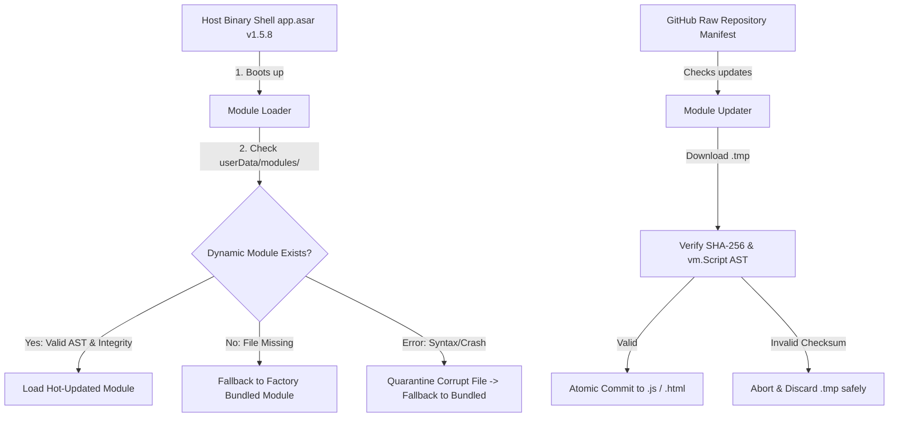

# ALS Modular Hot-Update Architecture Guide

> **Target Audience**: Developers, DevOps, and System Administrators maintaining the ALS Automation Platform.  
> **Applicable Editions**: **ALS Server Hub** and **ALS Single Agent** (Full & Lite).  
> **Last Updated**: September 2026 (v1.5.8+)

---

## 1. Executive Summary

Historically, modifying any part of the ALS desktop application—such as tweaking an element selector in `automation.js`, improving error recovery in `hub-client.js`, adjusting a cron expression in `scheduler.js`, or improving UI styling—required recompiling and distributing a **~90MB NSIS installer executable**. Users were required to download the large binary, close the app, run the Windows installer wizard, and relaunch.

The **Modular Hot-Update Architecture** decouples the application into two tiers:
1. **The Host Binary Shell (~90MB, Static)**: Contains Electron, the Chromium engine, Node runtime, and the Playwright browser runner packaged inside `app.asar`. This shell rarely changes.
2. **The Dynamic Logic Modules (~150KB, Hot-Updatable)**: Contains all business logic, schedulers, cloud listeners, UI screens, and tray formatters. These modules update over-the-air in milliseconds without reinstalling.



---

## 2. The 8 Modular Targets

The following 8 modules are hot-updatable:

| Module Identifier | File Name | Type | Description | Hot-Reload Behavior |
| :--- | :--- | :--- | :--- | :--- |
| `automation` | `automation.js` | Engine | Playwright automation, clock in/out execution, proof capture | Relaunch app |
| `hub-client` | `hub-client.js` | Engine | Multi-account orchestrator, atomic command recovery, heartbeat | Relaunch app |
| `scheduler` | `scheduler.js` | Engine | Daily schedule generator, node-cron tasks, missed action checks | Relaunch app |
| `supabase-client`| `supabase-client.js`| Network | Supabase realtime WebSocket listeners, offline sync queue | Relaunch app |
| `cache-manager` | `cache-manager.js` | Storage | Local JSON caching, settings persistence, hub account management | Relaunch app |
| `tray-manager` | `tray-manager.js` | UI/Tray | Windows tray tooltip formatting and tray context menus | Immediate / Tray refresh |
| `hub-ui` | `hub-ui.html` | UI | Administrative dashboard for ALS Server Hub | Immediate / Window reload |
| `desktop-ui` | `desktop-ui.html` | UI | Single Agent user interface | Immediate / Window reload |

---

## 3. Step-by-Step: How to Push an Update in the Future (No Installer Needed!)

Follow these 4 simple steps whenever you make changes to business logic or UI:

### Step 1: Make Your Code Changes
Edit any of the 8 modular files in `desktop-app/` (e.g., updating an element selector in `automation.js`, adding a feature in `hub-ui.html`, or refining `supabase-client.js`).

### Step 2: Run the Manifest & Auto-Versioner Command
In your terminal, navigate to `desktop-app/` and run:
```bash
npm run update-manifest
```

> [!TIP]
> **Zero-Human-Error Auto-Increment Engine**:
> You **do not need to remember to manually bump version numbers**!
> When you run `npm run update-manifest`, the generator:
> 1. Compares the current SHA-256 hash of each module against the recorded hash in `modules-manifest.json`.
> 2. **Auto-detects code edits**: If a file was modified but its version constant was not bumped, it **automatically increments the patch version** (`1.6.4` $\rightarrow$ `1.6.5`).
> 3. **Rewrites the version in-place**: Updates the `const VERSION = '...'` or `<!-- VERSION: ... -->` directly inside the source file!
> 4. Validates JavaScript AST syntax via Node's `new vm.Script(...)` to guarantee no broken code is released.
> 5. Writes the new SHA-256 checksums, timestamps, and versions into `modules-manifest.json`.
> 6. Synchronizes `package.json` to match the highest module version.

#### Advanced CLI Options:
```bash
# Standard auto-detection (patch increment for changed modules)
npm run update-manifest

# Bump minor version across modified modules (e.g. 1.6.4 -> 1.7.0)
node update-manifest.js --bump=minor

# Explicitly set manifest and module target version
node update-manifest.js 1.7.0
```

Example console output with auto-bump:
```
======================================================
  ALS Modular Manifest Generator & Auto-Versioner
======================================================

⚡ [AUTO-BUMP] Detected code changes in automation.js without version bump.
   Auto-incrementing 1.6.4 -> 1.6.5 in file and manifest...
✓ automation.js        [v1.6.5]    32.6 KB  SHA: e49c381cb87911c2...
✓ hub-client.js        [v1.6.4]    13.3 KB  SHA: 414d70b240ad2c5e...
✓ scheduler.js         [v1.5.8]    18.7 KB  SHA: 4978584176387dc3...
✓ supabase-client.js   [v1.6.4]    14.3 KB  SHA: 6e591947bbf65733...
✓ cache-manager.js     [v1.5.8]    10.7 KB  SHA: a53b8baeae4a0f60...
✓ tray-manager.js      [v1.5.8]     3.3 KB  SHA: 5f6eb0fac3a40211...
✓ hub-ui.html          [v1.6.4]    89.0 KB  SHA: c61a16dea3845574...
✓ desktop-ui.html      [v1.6.4]    78.5 KB  SHA: d2ebc665b5e5d750...

[SUCCESS] Updated manifest (v1.6.5) written to: desktop-app/modules-manifest.json
[INFO] Auto-bumped 1 module(s) due to detected code edits.
[SYNC] Updated package.json version to v1.6.5
```

### Step 3: Run the Test Suite
Ensure all automated unit tests pass:
```bash
npm test
```

### Step 4: Commit and Push to GitHub
Commit your changes and push to `main`:
```bash
git add desktop-app/ modules-manifest.json
git commit -m "feat(automation): hotfix portal selector"
git push origin main
```

**That's all!** You do **not** need to run `electron-builder` or distribute an installer.

---

## 4. How the Desktop Client Installs Updates

Once the commit is pushed to the `main` branch:

1. **Detection**:
   - The user opens the app or clicks **"Check for Module Updates"** from the system tray menu.
   - Alternatively, they open the app's **Updates tab** (in Server Hub) or **Settings > Modular Hot-Updates** (in Single Agent) and click **"Check for Updates"**.
   - The app fetches `https://raw.githubusercontent.com/al89er/ALS/main/desktop-app/modules-manifest.json`.

2. **Download & Verification (Two-Phase Commit)**:
   - For every module whose version is newer than the local version:
     - The file is downloaded to `AppData/Roaming/ALS-<Edition>/modules/<filename>.tmp-<timestamp>`.
     - The engine computes the file's SHA-256 hash. If it does not match the manifest, the file is immediately discarded.
     - The engine runs a syntax compilation check via Node's `new vm.Script(...)`. If invalid, the download is discarded.
     - The engine atomically renames `.tmp` to the active file.
     - The local `installed-manifest.json` is updated.

3. **Activation**:
   - For UI screens (`hub-ui.html`, `desktop-ui.html`), changes take effect immediately on reload.
   - For background engine code (`automation.js`, `hub-client.js`, `scheduler.js`), the UI displays a **"Relaunch App"** button (`app.relaunch(); app.exit(0);`).

---

## 5. Security & Fail-Safe Architecture (Zero-Bricking Guarantee)

### Safe Sandbox Isolation
Each edition stores dynamic updates in its isolated OS user directory:
- **Server Hub**: `C:\Users\<User>\AppData\Roaming\ALS-Hub\modules\`
- **Single Agent (Full)**: `C:\Users\<User>\AppData\Roaming\ALS-Full\modules\`
- **Lite Client**: `C:\Users\<User>\AppData\Roaming\ALS-Lite\modules\`

### Automatic Quarantine & Factory Fallback
If an updated module is ever corrupted (e.g. disk write failure or unexpected runtime crash during startup):
1. `module-loader.js` catches the exception.
2. The corrupt file is automatically renamed with a `.corrupt-<timestamp>` extension to prevent recurring boot loops.
3. The app **instantly falls back to the factory-bundled module inside `app.asar`**.
4. The application **will always launch and remain functional**.

### Dependency Bridging (`Module.createRequire`)
Dynamic modules loaded from `AppData` do not have a local `node_modules` folder. `module-loader.js` bridges `require()` calls to the Host Shell's bundled `package.json`. Dynamic modules can seamlessly call:
- `require('playwright')`
- `require('@supabase/supabase-js')`
- `require('node-cron')`
- `require('dotenv')`
- Sibling modules (e.g. `require('./cache-manager')` will prioritize an updated `cache-manager.js` if present, falling back to the bundled version).

---

## 6. Legacy Account & Settings Migration

When upgrading from previous versions:
- Server Hub previously shared `AppData\Roaming\ALS-Full` with the single agent.
- On first launch of Server Hub with the separated `ALS-Hub` sandbox:
  - `main.js` and `cache-manager.js` automatically check for `AppData\Roaming\ALS-Full\hub_accounts.json` and `local_settings.json`.
  - If found, they are automatically copied to `ALS-Hub`.
  - `automation.js` checks legacy `upm_session_*` paths so browser login cookies and session tokens are preserved without requiring users to log in again.

---

## 7. Local Testing & Overrides

### Test Updates Locally Before Pushing to GitHub
You can test the update mechanism against a local manifest file or server:
```powershell
# In PowerShell:
$env:ALS_UPDATE_MANIFEST_URL = "http://localhost:8080/modules-manifest.json"
npm start
```

### Manual Rollback
If you ever want to revert a machine to its factory-bundled state:
1. Open Windows Explorer and navigate to `AppData\Roaming\ALS-Hub\modules\` (or `ALS-Full\modules\`).
2. Delete the specific `.js` file or the entire `modules` folder.
3. Relaunch the app. It will immediately run the bundled factory code from `app.asar`.
